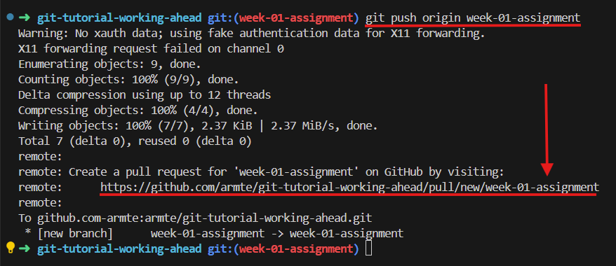

# How to work ahead using Git
This repository is to support the tutorial on how to successfully work ahead in Code the Dream while keeping the git repo well maintained.

Throughout the React class some assignments may come natural and 'easy' for you. In this case you each week may allocate more time than you need to complete a given assignment and you may want to work ahead. That's okay! However, when you do work ahead you've got to make sure your git history is well maintained and accurate.

## The Standard Process fo Working from Assignment to Assigment
Typically when a student is working on an assignment they'll follow these steps to create a branch to develop the assignment on:
1. Switch to your main branch to execute a git pull to ensure your local main branch reflects the current state of the remote main branch. This is to ensure your main branch has all the same changes your remote branch. This is important because when pull requests are merged, the changes are applied to the *remote* main branch and you must execute a git pull on your local main branch to apply those recent changes to your local main branch  

    Commands: <code>git switch main; git pull origin main</code>  

2. Create a new branch to develop the changes that the assignment introduces.  
    
    Commands: <code>git switch -c week-01-assignment</code>

3. Make your changes and apply them using a combination of:  
   - <code>Edit and save files</code>
   - <code>git add</code>
   - <code>git commit -m "\<commit type\>: commit message"</code>
4. Once your commit messages satisfy the assignment, open a pull request for an assignment reviewer to approve.

    Commands: `git push origin <branch_name>`
  
    Once the branch has been pushed to the remote repository (the 'origin' in the command pushes it to the remote repository) then you can open up
  a pull request for it by clicking on the link supplied in the terminal output resulting from the push command or by navigating to the branch in the browser via github.com and opening up a pull request there.

    

5. Your reviewer reviews and approves your pull request, allowing you to merge it into your main branch.

6. The assignment branch is merged into main and the assignment is complete.

7. Start this cycle of work again by updating the main branch and creating a new branch for the next assignment:

    Commands: `git switch main; git pull origin main; git switch -c week-02-assignment`

Now this is the ideal workflow when completing assignments. However, your reviewers aren't NPC's whose entire existence is devoted to reviewing your assignments. They're also main characters with their own lives who are generously volunteering their time to Code the Dream. They have their own jobs and careers to attend to during the week and sometimes that will be their priority over volunteering. This means there will be times where they won't get to your pull requests until the weekend after you submit your assignment. Additionally, there may be times when you have some free time at the end of one week and want to get a head start on the next week's assignment. In either of these two situations the above sequence of work does not apply.

Instead of merging the previous week's assignment into main prior to creating a branch for the next assignment, you'll create a branch off of your previous assignment's branch in order to continue working on the code from the point of completion of the previous week's assignment.

Commands: `git switch week-01-assignment; git switch -c week-02-assignment`

Now we have the situation where two assignments are potentially awaiting review and merge into the `main` branch. Specifically, week-02-assignment branch not only has commits from week-01-assignment but also commits specific to week-02-assignment. The subsequent pull request for the week-02-assignment will show changes not only for the week 2 assignment but also for the week 1 assignment. All these changes can make it difficult for the reviewer to assess the code changes specific to the week 2 assignment.

At some point the week 1 assignment will be merged into main BUT the branch for week 2 will still show those commits for week 1 as "new" commits because it has not been updated with the main branch. It is not aware of the updated main branch unless we make it aware. That's what we will do in this tutorial.

At the end of this tutorial you will have three pull requests in total:
1. A pull request for a "week-01-assignment" branch
2. A pull request for a "week-02-assignment" branch prior to the week 1 assignment being merged into main
3. A pull request for a "week-02-assignment-updated" branch identical to the "week-02-assignment" branch but with the difference of having been updated **after** the "week-01-assignment" branch was merged into main.
